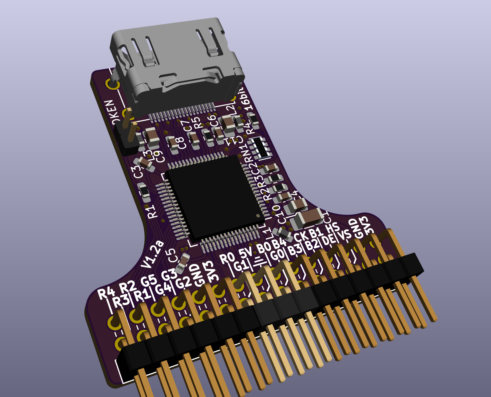
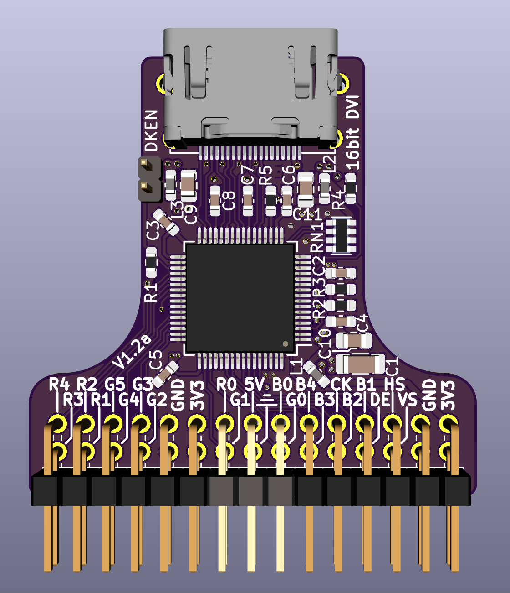
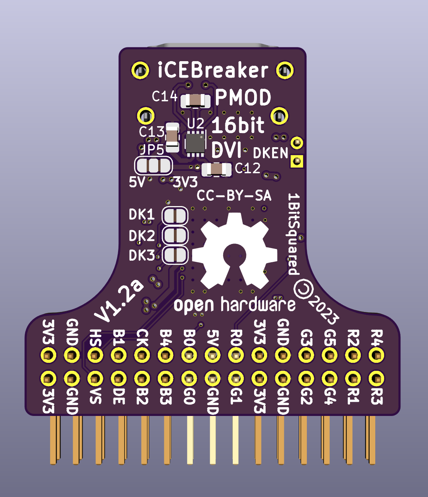
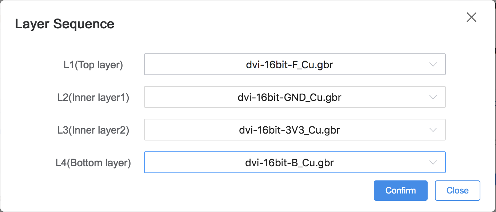
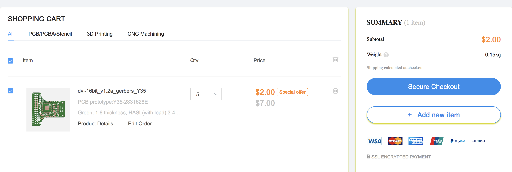

# DVI 16-bit (RGB565)
My Re-design of the Icebreaker DVI PMOD to 16-bit (RGB565) PCB with handsolder footprints.

***

 

 

 

***

BOM v1.2a
---------
Designator  | Name/Value   | Package | Notes
-|-|-|-|
J1,J2,J3 | 1 pcs 2X15 Pin Double Row Right Angle Male Pin Header 2.54mm pitch | 2x15 2.54mm pitch | [2x15 Pin Header](https://www.aliexpress.com/item/4001257532427.html)
J4 | HDMI 1.4 Receptacle Connector 19 Position Surface Mount, Right Angle TH | HDMI Receptacle | [Amphenol 10029449-111RLF](https://www.digikey.com/en/products/detail/amphenol-icc-fci/10029449-111rlf/2785386)
U1 | Video Transmitter IC I²C DVI 1.0 | 64-TQFP (10x10) Package | [SII164](https://www.digikey.com/en/products/detail/lattice-semiconductor-corporation/SII164CTG64/6596652) or [TFP410](https://www.digikey.com/en/products/detail/texas-instruments/TFP410PAP/454241)
U2 (Optional) | Charge Pump Switching Regulator IC Positive Fixed 5V 1 Output 200mA, LM2775 | 8-WSON (2x2) | [LM2775](https://www.digikey.com/en/products/detail/texas-instruments/LM2775DSGR/5438061) (Optional) Important! Do not solder-blob JP5 in any way if this one is populated.
L1,L2,L3 | 600 Ohms @ 100 MHz 1 Power, Signal Line Ferrite Bead | 0603 | For example: [HZ0603C601R-10](https://www.digikey.com/en/products/detail/laird-signal-integrity-products/HZ0603C601R-10/806619)
R1 | 10k | 0603 | Pull-up resistor for DKEN (JP4).
R2 | 33k | 0603 | Pull-up resistor for VREF in resistor-divider circuit with R3, tie high for High-Swing mode, do not populate R3.
R3 | 91k | 0603 | DNP (Do not populate) unless you want configure for low-swing input signal levels.
R4 | 10k | 0603 | Pull-down resistor for ISEL/RSTn.
R5 | 510 Ω | 0603 | TFADJ-resistor for DVI-compliant V(SWING) range. (505-515) Min/Max.
RN1 | Resistor pack 10k (CAY16-103J4LF) | 1206 | [CAY16-103J4LF](https://www.digikey.com/en/products/detail/bourns-inc/CAY16-103J4LF/431579) Pull-ups for EDGE/HTPLG, PDn, BSEL/SCL and Pull-down for DSEL/SDA.

