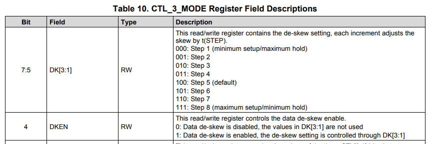

# DVI 16-bit (RGB565)
My Re-design of the Icebreaker DVI PMOD to 16-bit (RGB565) PCB with handsolder footprints.

***

 

 

 

***

BOM v1.2a
---------
Designator  | Name/Value   | Package | Notes
-|-|-|-|
J1,J2,J3 | 1 pcs 2X15 Pin Double Row Right Angle Male Pin Header 2.54mm pitch | 2x15 2.54mm pitch | [2x15 Pin Header](https://www.aliexpress.com/item/4001257532427.html)
J4 | HDMI 1.4 Receptacle Connector 19 Position Surface Mount, Right Angle TH | HDMI Receptacle | [Amphenol 10029449-111RLF](https://www.digikey.com/en/products/detail/amphenol-icc-fci/10029449-111rlf/2785386)
U1 | Video Transmitter IC I²C DVI 1.0 | 64-TQFP (10x10) Package | [SII164](https://www.digikey.com/en/products/detail/lattice-semiconductor-corporation/SII164CTG64/6596652) or [TFP410](https://www.digikey.com/en/products/detail/texas-instruments/TFP410PAP/454241)
U2 (Optional) | Charge Pump Switching Regulator IC Positive Fixed 5V 1 Output 200mA, LM2775 | 8-WSON (2x2) | [LM2775](https://www.digikey.com/en/products/detail/texas-instruments/LM2775DSGR/5438061) (Optional) Important! Do not solder-blob JP5 in any way if this one is populated.
L1,L2,L3 | 600 Ohms @ 100 MHz 1 Power, Signal Line Ferrite Bead | 0603 | For example: [HZ0603C601R-10](https://www.digikey.com/en/products/detail/laird-signal-integrity-products/HZ0603C601R-10/806619)
R1 | 10k | 0603 | Pull-up resistor for DKEN (JP4).
R2 | 33k | 0603 | Pull-up resistor for VREF in resistor-divider circuit with R3, tie high for High-Swing mode, do not populate R3.
R3 | 91k | 0603 | DNP (Do not populate) unless you want configure for low-swing input signal levels.
R4 | 10k | 0603 | Pull-down resistor for ISEL/RSTn.
R5 | 510 Ω | 0603 | TFADJ-resistor for DVI-compliant V(SWING) range. (505-515) Min/Max.
RN1 | Resistor pack 10k (CAY16-103J4LF) | 1206 | [CAY16-103J4LF](https://www.digikey.com/en/products/detail/bourns-inc/CAY16-103J4LF/431579) Pull-ups for EDGE/HTPLG, PDn, BSEL/SCL and Pull-down for DSEL/SDA.
C1 | 10uF | 1206 | 5V Decoupling capacitor for external VIN 5V header.
C2-C8 | 100nF | 0603 | 3V3 Decoupling capacitor.
C9-C11 | 10uF | 0805 | 3V3 Decoupling capacitor.
C12-C13 | 10uF | 0805 | 3V3 Decoupling capacitor for LM2775 if populated.
C14 | 1uF | 0805 | 3V3 Decoupling capacitor for LM2775 if populated.
JP4 | JP-header | 2.00mm (2 x 1) Pin Male Header | DKEN-setting by 2.00mm jumper-block

JP settings:

* JP4 (DKEN) 
  When the I2C bus is disabled which it is with R4 pull-down (ISEL = low) this JP has the following function: 
  * DKEN = LOW (Jumper closed), then default De-skewing setting is used.
  * DKEN = HIGH (Jumper open), the DK[3:1] is used as the De-skewing setting. The De-skewing increments are TSTEP. Please see Data De-skew Table below.
  Adjusts the setup and hold times of the pixel data inputs DATA[23:0], relative to the clock input IDCK±

All three DK[3:1] inputs support 3.3V CMOS signal levels and contain weak pulldown resistors so that if left unconnected, no solder-blob on JP-pad, they default to all low.

* JP3 (DK3), Sets the de-skew input bit 7. Default low, solder-blob to set it high.
* JP2 (DK2), Sets the de-skew input bit 6. Default low, solder-blob to set it high.
* JP1 (DK1), Sets the de-skew input bit 5. Default low, solder-blob to set it high.

